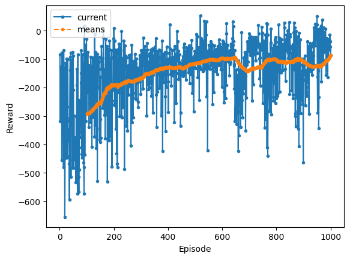

```python
from itertools import count

import torch
import torch.nn as nn
import torch.nn.functional as F
import torch.optim as optim
import utils
from IPython import display

utils.reproducibility()


class Actor(nn.Module):
    def __init__(self, in_dims: int, out_dims: int):
        super(Actor, self).__init__()

        hidden_dim = 128

        self.layer = nn.Sequential(
            nn.Linear(in_dims, hidden_dim),
            nn.ReLU(),
            nn.Linear(hidden_dim, hidden_dim),
            nn.ReLU(),
            nn.Linear(hidden_dim, out_dims),
            nn.Softmax(dim=-1),
        )
        self.apply(utils.init_weights)

    def forward(self, x):
        return self.layer(x)


class Critic(nn.Module):
    def __init__(self, in_dims: int):
        super(Critic, self).__init__()

        hidden_dim = 128

        self.layer = nn.Sequential(
            nn.Linear(in_dims, hidden_dim),
            nn.ReLU(),
            nn.Linear(hidden_dim, hidden_dim),
            nn.ReLU(),
            nn.Linear(hidden_dim, 1),
        )
        self.apply(utils.init_weights)

    def forward(self, x):
        return self.layer(x)


LR = 1e-3
GAMA = 0.97
device = utils.get_device()


class ActorCritic(nn.Module):
    def __init__(self, in_dims: int, out_dims: int):
        super(ActorCritic, self).__init__()

        self.actor = Actor(in_dims, out_dims)
        self.critic = Critic(in_dims)

        self.actor_optim = optim.Adam(self.actor.parameters(), lr=LR)
        self.critic_optim = optim.Adam(self.critic.parameters(), lr=LR)

        self.rs = []
        self.vs = []
        self.log_probs = []

    def store(self, r, v, log_prob):
        self.rs.append(r)
        self.vs.append(v)
        self.log_probs.append(log_prob)

    def forward(self, state):
        action_probs = self.actor(state).squeeze()
        action = torch.multinomial(action_probs, 1)
        log_prob = torch.log(action_probs[action])
        v = self.critic(state)
        return action.item(), v, log_prob

    def train(self):
        rs = torch.tensor(self.rs, dtype=torch.float32).to(device)
        vs = torch.stack(self.vs).to(device).squeeze()
        next_vs = (
            torch.cat(
                (
                    vs[1:].clone().detach(),
                    torch.tensor([0.0], dtype=torch.float32).to(device),
                )
            )
            * GAMA
        )
        log_probs = torch.stack(self.log_probs).to(device)

        G = (rs + next_vs - vs).detach()
        actor_loss = -torch.sum(G * log_probs)
        critic_loss = F.mse_loss(rs + next_vs, vs)

        self.actor_optim.zero_grad()
        actor_loss.backward()
        self.actor_optim.step()

        self.critic_optim.zero_grad()
        critic_loss.backward()
        self.critic_optim.step()

        self.rs = []
        self.vs = []
        self.log_probs = []


env, in_dims, out_dims = utils.create_env(device=device)


agent = ActorCritic(in_dims, out_dims).to(device)
display.display(agent)
```


    ActorCritic(
      (actor): Actor(
        (layer): Sequential(
          (0): Linear(in_features=8, out_features=128, bias=True)
          (1): ReLU()
          (2): Linear(in_features=128, out_features=128, bias=True)
          (3): ReLU()
          (4): Linear(in_features=128, out_features=4, bias=True)
          (5): Softmax(dim=-1)
        )
      )
      (critic): Critic(
        (layer): Sequential(
          (0): Linear(in_features=8, out_features=128, bias=True)
          (1): ReLU()
          (2): Linear(in_features=128, out_features=128, bias=True)
          (3): ReLU()
          (4): Linear(in_features=128, out_features=1, bias=True)
        )
      )
    )


```python
def run_episode() -> float:
    state, _ = env.reset()
    tot_r = 0
    for _ in count():
        a, v, log_prob = agent(state)
        next_s, r, terminated, truncated, _ = env.step(a)

        tot_r += r
        agent.store(r, v, log_prob)

        state = next_s
        if terminated or truncated:
            agent.train()
            break

    return tot_r


rs = []
for _ in range(1000):
    rs.append(run_episode())
    utils.plot(rs)
```




### References:

<cite>[Weng, Lilian - Policy Gradient Algorithms#reinforce][1]</cite>

<cite>[Sutton & Barto - Reinforcement Learning: An Introduction][2]</cite>

[1]: https://lilianweng.github.io/posts/2018-04-08-policy-gradient/#reinforce
[2]: http://incompleteideas.net/book/bookdraft2017nov5.pdf
