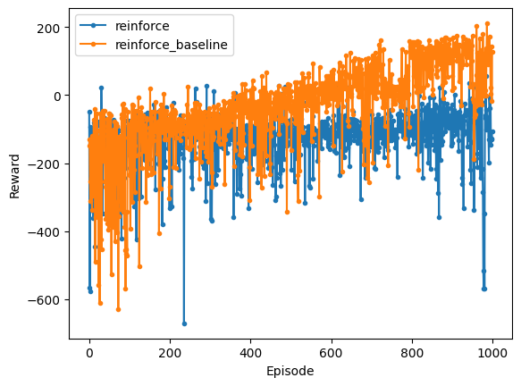

[LunarLander-v2][1]

[1]: https://gymnasium.farama.org/environments/box2d/lunar_lander/


```python
from itertools import count

import numpy as np
import torch
import torch.nn as nn
import torch.nn.functional as F
import torch.optim as optim
import utils
from IPython import display


class Policy(nn.Module):
    def __init__(self, in_dims: int, out_dims: int):
        super(Policy, self).__init__()
        hidden_dim = 128
        self.layer = nn.Sequential(
            nn.Linear(in_dims, hidden_dim),
            nn.ReLU(),
            nn.Linear(hidden_dim, hidden_dim),
            nn.ReLU(),
            nn.Linear(hidden_dim, out_dims),
            nn.Softmax(dim=-1),
        )
        self.apply(utils.init_weights)

    def forward(self, x):
        return self.layer(x)


class Baseline(nn.Module):
    def __init__(self, in_dims: int):
        super(Baseline, self).__init__()
        hidden_dim = 128
        self.layer = nn.Sequential(
            nn.Linear(in_dims, hidden_dim),
            nn.ReLU(),
            nn.Linear(hidden_dim, hidden_dim),
            nn.ReLU(),
            nn.Linear(hidden_dim, 1),
        )
        self.apply(utils.init_weights)

    def forward(self, x):
        return self.layer(x)


device = utils.get_device()

env = utils.create_env(device=device)
in_dims = env.observation_space.shape[0]
out_dims = env.action_space.n

LR = 1e-3
GAMA = 0.99


class REINFORCE:
    def __init__(self, baseline=False):
        self.policy = Policy(in_dims, out_dims).to(device)
        self.baseline = None
        if baseline:
            self.baseline = Baseline(in_dims).to(device)
            self.baseline_optimizer = optim.Adam(self.baseline.parameters(), lr=LR)
            self.state_value = []

        self.optimizer = optim.Adam(self.policy.parameters(), lr=LR)
        self.rs = []
        self.log_probs = []

    def select_action(self, state):
        action = self.policy(state).squeeze()
        a = np.random.choice(out_dims, p=action.cpu().detach().numpy())
        if self.baseline:
            self.state_value.append(self.baseline(state))
        return a, torch.log(action[a])

    def store(self, r, log_prob):
        self.rs.append(r)
        self.log_probs.append(log_prob)

    def learn(self):
        R = 0
        G = []
        for r in self.rs[::-1]:
            R = r + GAMA * R
            G.insert(0, R)
        G = torch.tensor(G, device=device, dtype=torch.float32)

        if self.baseline:
            self.state_value = torch.stack(self.state_value).squeeze()
            state_loss = F.mse_loss(self.state_value, G)
            self.baseline_optimizer.zero_grad()
            state_loss.backward()
            self.baseline_optimizer.step()

            G = G - self.state_value.detach()
            self.state_value = []

        log_probs = torch.stack(self.log_probs)
        loss = -torch.sum(G * log_probs)

        self.optimizer.zero_grad()
        loss.backward()
        self.optimizer.step()

        self.rs = []
        self.log_probs = []

    def show(self):
        display.display(self.policy)
        if self.baseline:
            display.display(self.baseline)

reinforce = REINFORCE()
reinforce_rs = []

reinforce_baseline = REINFORCE(baseline=True)
reinforce_baseline_rs = []

reinforce.show()
reinforce_baseline.show()
```


    Policy(
      (layer): Sequential(
        (0): Linear(in_features=8, out_features=128, bias=True)
        (1): ReLU()
        (2): Linear(in_features=128, out_features=128, bias=True)
        (3): ReLU()
        (4): Linear(in_features=128, out_features=4, bias=True)
        (5): Softmax(dim=-1)
      )
    )


    Policy(
      (layer): Sequential(
        (0): Linear(in_features=8, out_features=128, bias=True)
        (1): ReLU()
        (2): Linear(in_features=128, out_features=128, bias=True)
        (3): ReLU()
        (4): Linear(in_features=128, out_features=4, bias=True)
        (5): Softmax(dim=-1)
      )
    )


    Baseline(
      (layer): Sequential(
        (0): Linear(in_features=8, out_features=128, bias=True)
        (1): ReLU()
        (2): Linear(in_features=128, out_features=128, bias=True)
        (3): ReLU()
        (4): Linear(in_features=128, out_features=1, bias=True)
      )
    )


```python
def run_reinforce(agent) -> float:
    state, _ = env.reset()
    tot_r = 0
    for _ in count():
        a, log_prob = agent.select_action(state)
        next_s, r, terminated, truncated, _ = env.step(a)

        tot_r += r
        agent.store(r, log_prob)

        state = next_s
        if terminated or truncated:
            agent.learn()
            break

    return tot_r


def main():
    reinforce_rs.append(run_reinforce(reinforce))
    reinforce_baseline_rs.append(run_reinforce(reinforce_baseline))
    utils.plots(
        {
            "reinforce": reinforce_rs,
            "reinforce_baseline": reinforce_baseline_rs,
        }
    )


for _ in range(1000):
    main()
```





### References:

<cite>[Weng, Lilian - Policy Gradient Algorithms#reinforce][1]</cite>

<cite>[Seita’s Place - Going Deeper Into Reinforcement Learning: Fundamentals of Policy Gradients][2]</cite>

<cite>[Sutton & Barto - Reinforcement Learning: An Introduction][3]</cite>

[1]: https://lilianweng.github.io/posts/2018-04-08-policy-gradient/#reinforce
[2]: https://danieltakeshi.github.io/2017/03/28/going-deeper-into-reinforcement-learning-fundamentals-of-policy-gradients/
[3]: http://incompleteideas.net/book/bookdraft2017nov5.pdf
